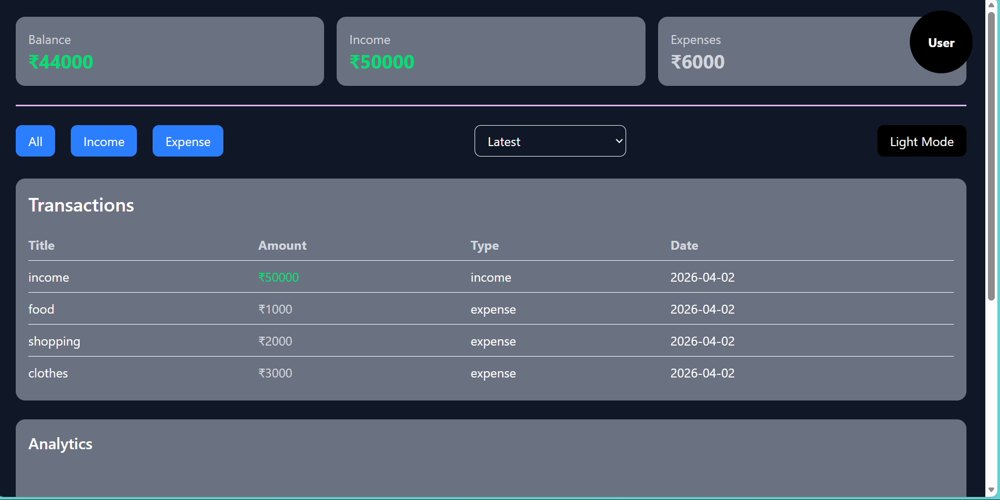
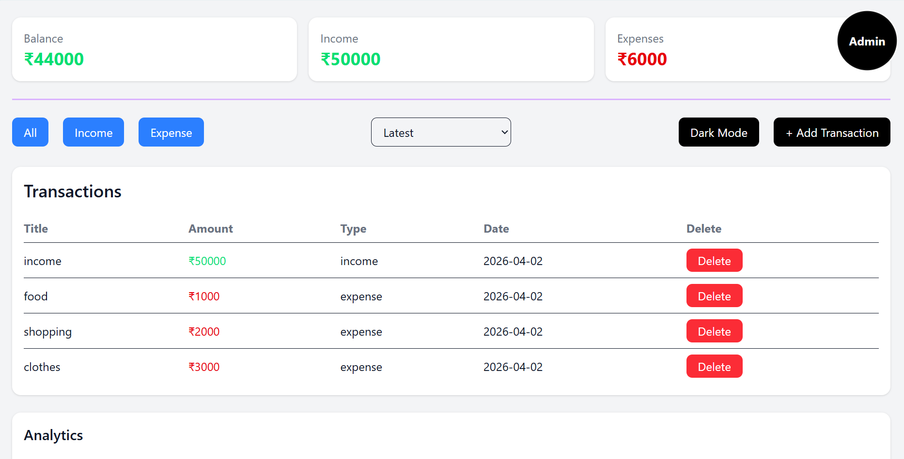

# 💰 Finance Dashboard

A modern and interactive finance dashboard built using React and Tailwind CSS.  
It helps users track income, expenses, and visualize financial data with a clean and responsive UI.

---

## Features

- Dashboard with Total Balance, Income, and Expenses  
- Transactions table with title, amount, type, and date
- Add new transactions only for admin
- Delete transactions only for admin
- Search transactions  
- Sort transactions (date & amount)  
- Filter transactions (All / Income / Expense)  
- Dark / Light mode  
- Data persistence using localStorage  
- Pie Chart (Income vs Expense) 
- Insights section (spending analysis)  
- Fully responsive design  

---

## Tech Stack

- React.js  
- Tailwind CSS  
- Recharts  
- JavaScript (ES6)  

---

## Installation & Setup

1. Clone the repository

    git clone https://github.com/dheerajkaushik1/finance-dashboard.git

2. Navigate to project folder

    cd finance-dashboard

3. Install dependencies

    npm install

4. Run the app

    npm run dev

## Screenshots
 Dashboard (Dark Mode)
 

 Dashboard (Light theme)
 

## Future Improvements
- Edit transaction feature
- Category-based analytics
- Backend integration (database)
- User authentication

## Author
- dheerajkaushik1
